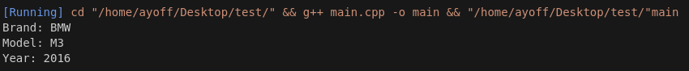

# Shared Memory Demo Project

Bu proje, Qt kullanarak paylaşılan bellek ile veri yazma ve okuma işlemlerini gerçekleştirmeyi amaçlamaktadır. Proje, bir otomobilin markasını, modelini ve üretim yılını saklamak için paylaşılan bellek kullanmaktadır.

## Gereksinimler

- Qt (5.x veya 6.x)
- C++11 veya daha yenisi
- POSIX uyumlu bir işletim sistemi (Linux, macOS vb.)
- GCC veya Clang gibi bir C++ derleyici

## Proje Yapısı

- `widget.cpp`: Paylaşılan belleğe veri yazma ve okuma işlemlerini içeren ana widget sınıfı.
- `widget.h`: `Widget` sınıfının başlık dosyası.
- `Car`: Otomobil bilgilerini saklamak için kullanılan yapı.

## Kurulum

1. Projeyi klonlayın veya indirin.

   ```bash
   git clone <repo-url>
   cd SharedMemoryDemoProject

## Resimler




